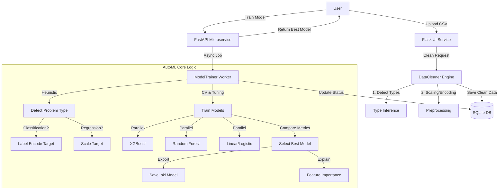

# 🚀 DataCleaner Pro: Automated ML Pipeline

### Hackathon Project Pitch
**Team:** [Your Name/Team Name]

---

## 🛑 The Problem
**Data Science is 80% Cleaning, 20% Modeling.**
- Data cleaning is tedious, repetitive, and error-prone.
- Selecting the best model requires testing 10+ algorithms and hyperparameters.
- Productionizing ML models is complex (API, scaling, monitoring).

Researchers and developers spend weeks just getting to a baseline model.

---

## ⚡ The Solution
**DataCleaner Pro** — An intelligent, end-to-end AutoML platform.
Upload your raw CSV, and verify the quality instantly. With one click, train and compare **Gradient Boosting, Random Forest, and Linear Models** to find the best performer automatically. And deploy it instantly as a REST API.

---

## 🌍 Why This Matters
**Democratizing AI for Everyone.**
- **Accelerate Discovery**: Researchers can focus on insights, not cleaning spreadsheets. By automating the tedious 80% of data prep, we unlock faster scientific breakthroughs and business decisions.
- **Trust & Transparency**: In a world of "black box" AI, our **Reliability Score** and **Explainability Charts** build trust. Users know *why* a prediction was made and *how reliable* it is.
- **Reduce Human Error**: Manual data cleaning is error-prone. Our consistent, automated pipeline ensures cleaner data and fairer models every time.

---

## 🧠 Key Innovations
### 1. Smart Data Cleaning
- **Auto-Detection**: Identifies ID columns, URLs, and constant features automatically.
- **Intelligent Imputation**: Fills missing values with median/mode strategies.
- **Advanced Preprocessing**: Handles Scaling (Standard/MinMax) and Encoding (OneHot/Label) seamlessly.

### 2. Auto-Model Selection
- **Dynamic Problem Detection**: Automatically detects Classification vs Regression based on target cardinality.
- **Hyperparameter Tuning**: Uses RandomizedSearchCV to optimize model performance.
- **Ensemble Power**: Compares XGBoost, Random Forest, and Linear Regression.

### 3. Reliability Scoring
- **Trust Metrics**: Provides a 0-100 "Reliability Score" based on dataset size, cross-validation stability, and metric quality.
- **Explainability**: Shows Top-10 Feature Importance charts to explain *why* the model predicts what it does.

### 4. Enterprise Architecture
- **Microservice Design**:
  - **Frontend/Orchestrator**: Flask (User Interface & Job Management).
  - **Training Engine**: FastAPI (Async High-Performance Worker).
- **Scalable**: Built on SQLAlchemy and Pandas, ready for larger datasets.

---

## 🛠 Tech Stack
- **Backend**: Python 3.10+
- **Web Frameworks**: Flask (UI), FastAPI (ML Service)
- **ML Libraries**: Scikit-Learn, XGBoost, Pandas, NumPy
- **Database**: SQLite (Metadata Store)
- **Deployment**: Docker-ready, Uvicorn/Gunicorn

---

## 🏛 System Architecture (The "Under the Hood" View)
Don't be fooled by the simple UI. This is a complex distributed system:

---

## 📊 Live Demo
1.  **Upload**: Drag & drop `housing_prices.csv`.
2.  **Clean**: View instant quality report (Missing: 0%, Duplicates: 0).
3.  **Train**: Click "Train Models". Watch as multiple algorithms compete.
4.  **Result**: 
    - **Best Model**: Random Forest Regressor (R²: 0.89).
    - **API Endpoint**: `POST /predict` is ready instantly.

---

## 🔮 Future Roadmap (The "Advanced" Vision)
- **Generative AI Integration**: "Chat with your Data" — natural language queries to generate SQL/Pandas code instantly (using **Local LLMs like Llama 3 via Ollama** or **Gemini Flash Free Tier**).
- **Auto-Deployment**: One-click push to AWS/Google Cloud with fully containerized Docker images.
- **Deep Learning**: Integration with TabNet (PyTorch) for ultra-complex tabular datasets.
- **Drift Detection**: Real-time alerts when production data deviates from training data.
